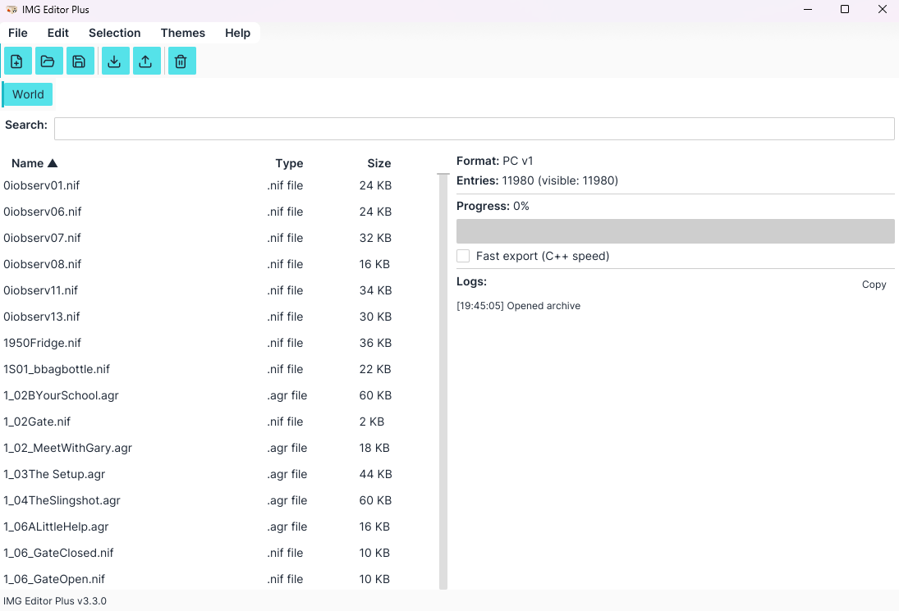
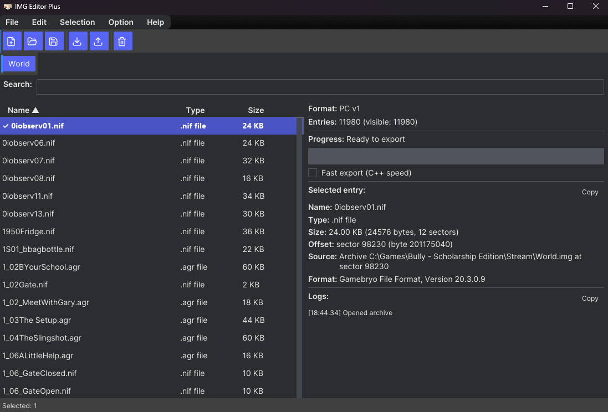
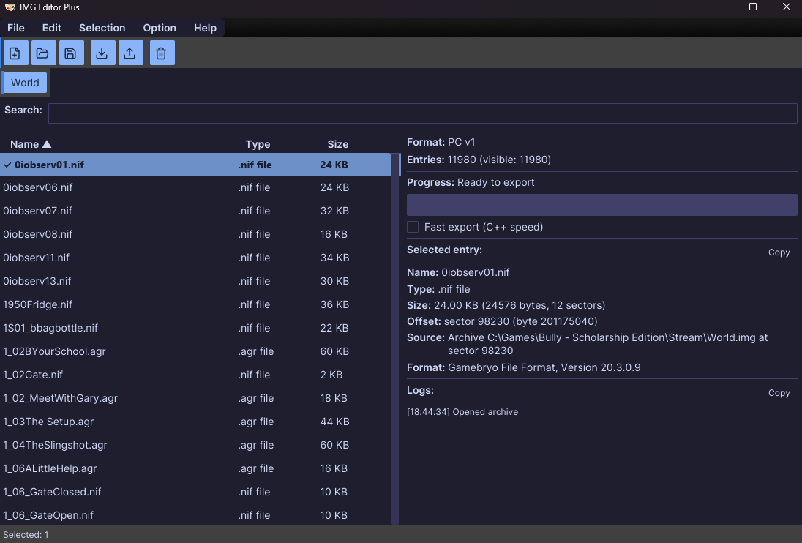
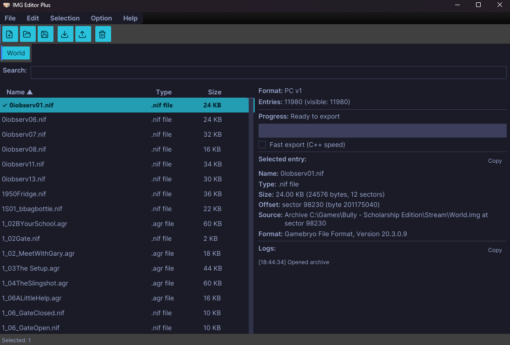
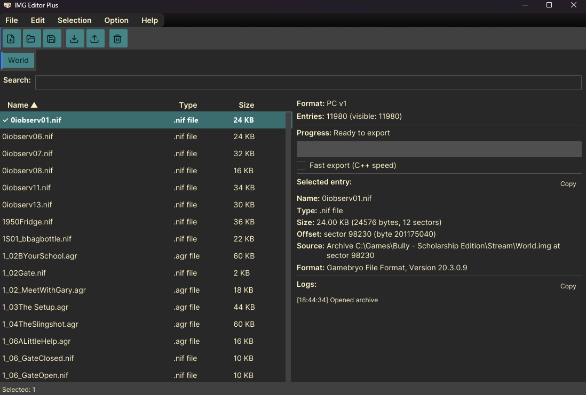
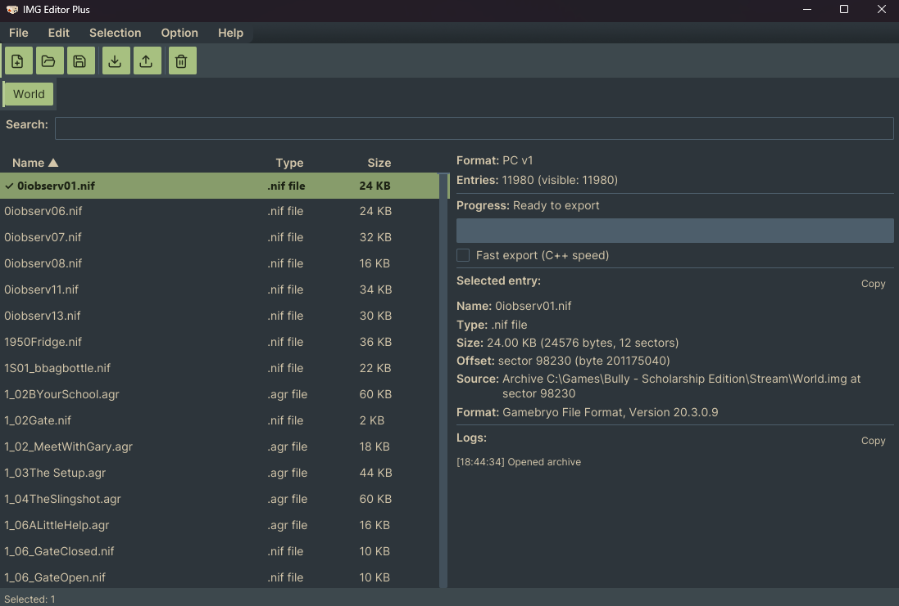

# 🎮 IMG Editor Plus v3.3

A **pure Rust** desktop editor for GTA IMG archives — built for **speed**, **safety**, and a modern workflow.

> Forked and evolved from [Grinch_'s IMG Editor](https://github.com/user-grinch/IMGEditor).  
> Rewritten in Rust to eliminate crashes, memory bugs, and dependency hell.

---

## 🔥 Why Rust?

The original C++ IMG Editor worked well, but maintaining it meant fighting:

| Problem | Rust fixes it |
|---------|---------------|
| 💥 **Null pointers / use-after-free** * | Ownership + borrow checker at compile time |
| 🧵 **UI thread blocking on I/O** * | Tokio `async` + spawn blocking for save/export |
| 📦 **Vendored C++ libs** (FreeType, FreeImage, GLFW, GLM, GLEW) | All dependencies via `cargo` — no manual setup |
| 🐛 **Memory corruption in format parsers** | `Result`-based error propagation, no unsafe |
| 🐌 **Slow exports on large archives** * | Chunked parallel export + per-worker `BufReader` reads; UI stays responsive and raw throughput is modestly faster than the reference C++ parser on our benchmark * |
| 🎨 **ImGui theming limitations** | Iced 0.14 reactive UI with a full design token system |

\* *A headless export benchmark on a 12,000-entry Bully `World.img` showed the optimized Rust export was roughly **1.06–1.07x** the C++ parser's throughput on the test machine when using the `Fast` engine (per-entry source open, matching the C++ benchmark). The default `Parallel` engine is also slightly faster (~1.06x) while keeping the UI responsive and supporting cancellation. See [docs/rust-vs-cpp-merits.md](docs/rust-vs-cpp-merits.md) and [docs/export-optimization-lessons.md](docs/export-optimization-lessons.md) for the full analysis.*
\* *The Rust port is not a magical order-of-magnitude speedup. The workload is Windows I/O-bound, and the C++ parser was already close to the practical warm-cache ceiling. Rust's reimplementation wins on throughput only modestly; its larger advantages are **safety, responsiveness, cancellation, and maintainability**. See [docs/rust-vs-cpp-merits.md](docs/rust-vs-cpp-merits.md) for the honest breakdown.*
\* *See [docs/cpp-codebase-analysis.md](docs/cpp-codebase-analysis.md) for a source-level review of the original C++ codebase. The null-pointer and UI-blocking issues are real, but the analysis shows they are more nuanced than the one-line summary suggests (e.g. save/export were already threaded in C++; the main remaining UI blockers were Open and Import).*
**Result**: a portable, single-binary editor that _won't_ segfault on a 10,000-entry archive.

---

## ✨ Features

### 📁 Archive Management
- ✅ **IMG v1** — GTA III, Vice City, Bully Scholarship Edition
- ✅ **IMG v2** — GTA San Andreas
- ✅ **Create / Open / Save / Save As** with version selection
- ✅ **Import files** — single, multiple, or replace mode
- ✅ **Export all or selected entries** — async with progress bar + cancel
- ✅ **Two export engines** — `Parallel` (default, responsive) or `Fast` (C++-like throughput); toggle via the "Fast export" checkbox in the info panel
- ✅ **Memory-mapped reads** — instant open on large archives
- ✅ **Multiple archive tabs** with dirty-file indicator
- ✅ **Drag-and-drop** — open `.img` archives or import files from Explorer

---

## 🐇 Fast Export Mode

By default, exports use the **`Parallel`** engine: chunk entries across Rayon
workers with per-worker `BufReader`s so the GUI stays responsive and you can
cancel mid-export.

If you prefer maximum raw throughput on Windows, enable **`Fast export`** in the
info panel. This engine mirrors the original C++ benchmark behavior: it opens
the source archive once per entry and writes each output file with a 1 MiB
buffer. On our warm-cache benchmark this was **~6.7 % faster than the C++
baseline**.

The setting is persisted to `settings.ini` as `fast_export`.

See [docs/rust-vs-cpp-merits.md](docs/rust-vs-cpp-merits.md) for the full
head-to-head numbers and [docs/export-optimization-lessons.md](docs/export-optimization-lessons.md)
for the engineering story behind the two engines.
### 🔍 Entry Table
- ✅ **Virtualised scrolling** — smooth even at 10,000+ entries
- ✅ **Real-time search filter** with debounced input (150ms)
- ✅ **Sort by Name / Type / Size** with arrow indicators
- ✅ **Multi-selection** — Ctrl+click toggle, Shift+click range
- ✅ **Inline rename** — double-click to edit
- ✅ **Context menu** — Render, View textures, Export, Rename, Delete

### 🖼️ 3D Model Viewer
- ✅ **NIF** (Gamebryo 20.3.0.9) — Bully Scholarship Edition models, textured OBJ+MTL or PLY export → system viewer
- ✅ **DFF** (RenderWare Clump) — GTA III/VC/SA models, PLY export → system viewer
- ✅ **COL** (Collision v1/v2/v3) — collision meshes with sphere/box debug shapes, PLY export → system viewer

### 🎨 Texture Viewer
- ✅ **TXD** (RenderWare Texture Dictionary) — full parser + 13 raster format decoder (DXT1/3/5, 1555, 565, 4444, 8888, PAL4, PAL8, + more)
- ✅ **Inline preview** — `image::Viewer` widget in the info panel
- ✅ **Multi-texture selector** — navigate textures within a TXD
- ✅ **Export to TGA** — dump all textures to `.tga` files

### 🧪 Entry Inspector
- ✅ **Per-entry metadata** — name, type, size, offset, source
- ✅ **RenderWare detection** — chunk type + version for `.txd`/`.dff`/`.ifp`
- ✅ **Collision version detection** — COLL / COL2 / COL3 / COL4
- ✅ **Text file line counts** — for `.ipl`/`.ide`/`.dat`/`.scm`
- ✅ **Hex preview** — first 32 bytes for unknown formats
- ✅ **Copy entry details** to clipboard

### 🏗️ Design & UX
- ✅ **6 theme modes** — System, Light, Catppuccin Mocha, Tokyo Night, Gruvbox Dark, **Everforest**
- ✅ **Design token system** — Tailwind-inspired color/spacing/radius/elevation scales, vendored in-tree
- ✅ **Smooth animation engine** — 26 easing curves, animated progress bar, animated status-bar pulse
- ✅ **Inter + Bricolage + Lucide icon fonts** — clean, modern typography
- ✅ **Resizable master/detail panes** — drag the splitter
- ✅ **Editable keyboard shortcuts** — see table below
- ✅ **DPI-aware** window sizing

---

## 🎨 Themes

Pick your vibe from the **View → Theme** menu. Every theme is wired into a shared design-token system so buttons, tables, modals, and accents stay consistent.

<details>
<summary>Click to preview all themes</summary>

### Default Light
A clean, neutral workspace that keeps the focus on your archive contents.


*Bright surfaces, crisp text, and a friendly blue accent — perfect for daytime editing.*

### Default Dark
The built-in dark mode for late-night archive work.


*Deep greys with subtle contrast and a calm purple primary — easy on the eyes in low light.*

### Catppuccin Mocha
A cozy, pastel-rich dark theme with soft pinks and blues.


*Warm, muted colors that feel like your favorite coffee shop playlist.*

### Tokyo Night
A sleek, neon-tinged dark theme inspired by the city after dark.


*Cool purples and electric cyans for a modern, developer-centric look.*

### Gruvbox Dark
A retro, low-contrast dark theme with earthy tones.


*Vintage amber and olive greens that hark back to classic terminal palettes.*

### Everforest 🌲
A comfortable green-based dark theme designed to be warm and soft.


*Muted sage greens and creamy text — the newest addition for users who want a natural, forest-inspired workspace.*

</details>

### ⚙️ Configuration
- ✅ **`settings.ini`** — persists theme, window geometry, last-used folders, update preferences
- ✅ **Auto-update checker** — GitHub release tags, semver comparison
- ✅ **Toggle update checks** — from the welcome dialog or Help menu
- ✅ **"Don't show again"** — welcome screen toggle

---

## 🚀 Quick start

Requires **Rust 1.96+** and a Windows desktop.

```powershell
cargo build --release
```

Binary: `target\release\imgeditor.exe`

Or package a release:

```powershell
.\package-release.ps1
```

The `dist\` folder then contains the portable `.exe` plus file-association notes.

---

## ⌨️ Keyboard shortcuts

| Shortcut | Action |
|----------|--------|
| `Ctrl+N` | New archive |
| `Ctrl+O` | Open archive |
| `Ctrl+S` | Save in place |
| `Shift+S` | Save as |
| `Ctrl+I` | Import files |
| `Shift+I` | Import and replace |
| `Ctrl+E` | Export all |
| `Shift+E` | Export selected |
| `Ctrl+A` | Select all |
| `Shift+A` | Invert selection |
| `Shift+X` | Close tab |
| `Delete` | Delete selected |

---

## 📦 Dependencies

Built on the [Iced](https://iced.rs/) GUI framework with Tokio async. Notable crates:

| Crate | Purpose |
|-------|---------|
| `iced 0.14` | Reactive GUI (image, svg, advanced, lazy) |
| `iced_aw 0.14` | Menu bar, tabs, context menus |
| `tokio 1.40` | Async runtime (multi-thread, fs, sync) |
| `memmap2` | Zero-copy archive reads |
| `rayon` | Parallel entry export |
| `rfd` | Native Windows file dialogs |
| `ureq` | Update checker (HTTP) |

---

## 🙏 Credits

- **Grinch_** — the original [IMG Editor](https://github.com/user-grinch/IMGEditor) that made this possible
- **MexUK & the IMGF team** — the [IMG Factory](https://github.com/MexUK/IMGF) whose feature set inspired many of the Plus additions (TXD tools, orphan detection — adapted and reimplemented in Rust)
- **CloudyTabzy & Agents** — Rust port, parsers, design system, 3D viewers
- **Iced team** — the reactive GUI framework this is built on

---

## 📄 License

This project is **MIT licensed** © 2025 CloudyTabzy. See [LICENSE](LICENSE) for the full text.

**Dependency licenses:** every crate this project depends on is MIT-licensed (Iced, Iced AW, Tokio, Rayon, etc.). The bundled fonts — Inter, Bricolage Grotesque, and Lucide icons — are licensed under the SIL Open Font License 1.1.
