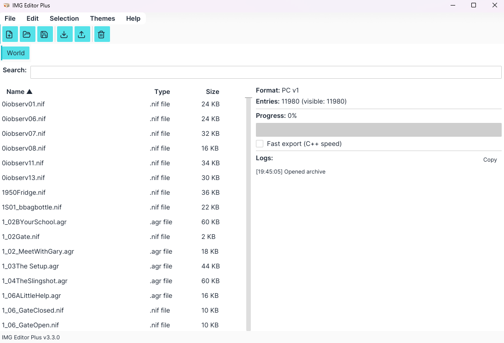
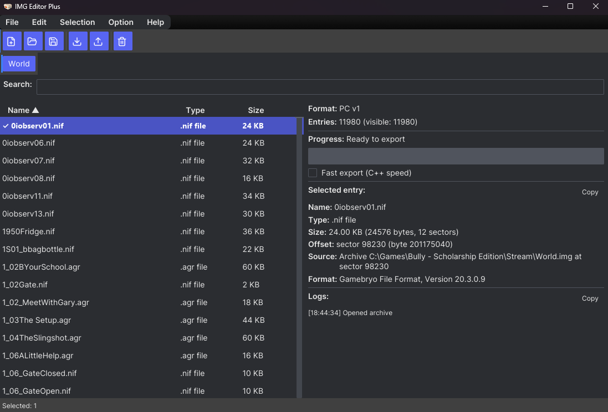
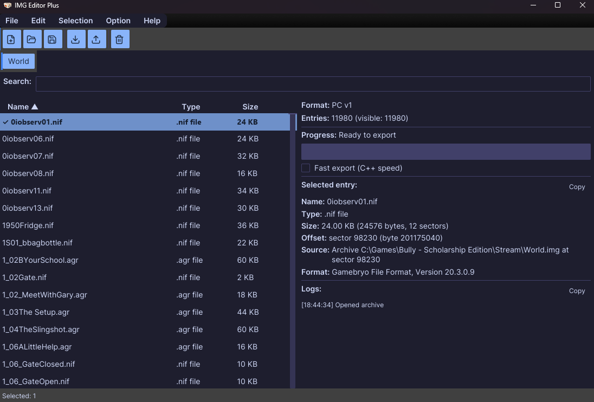
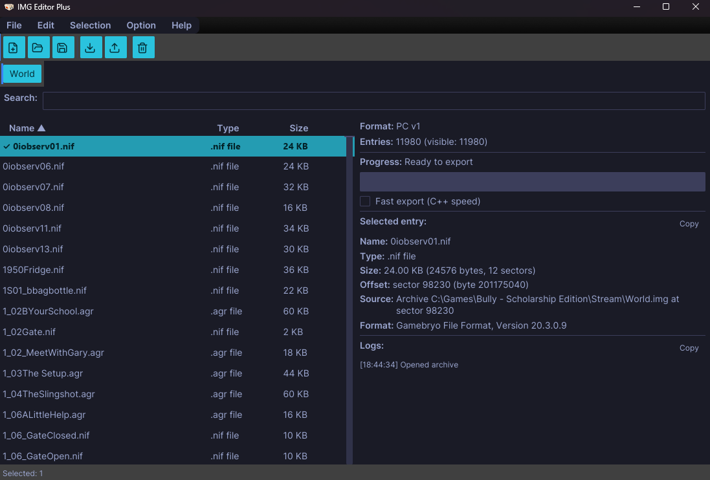
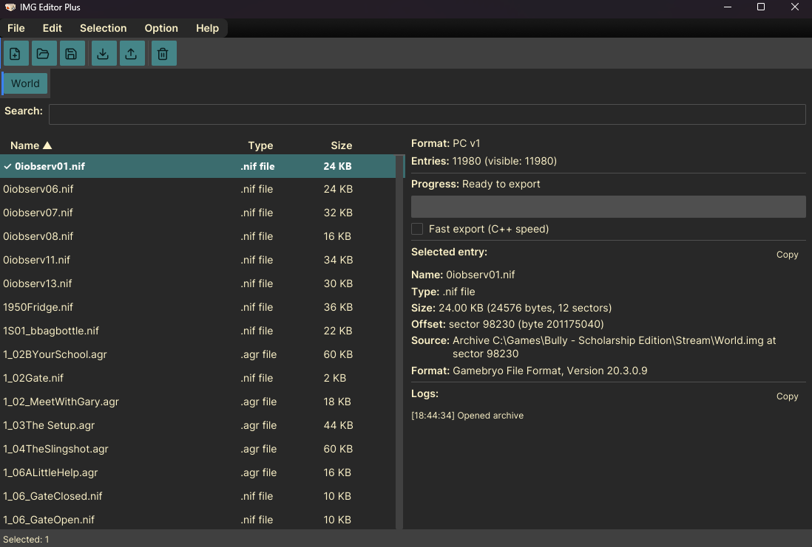
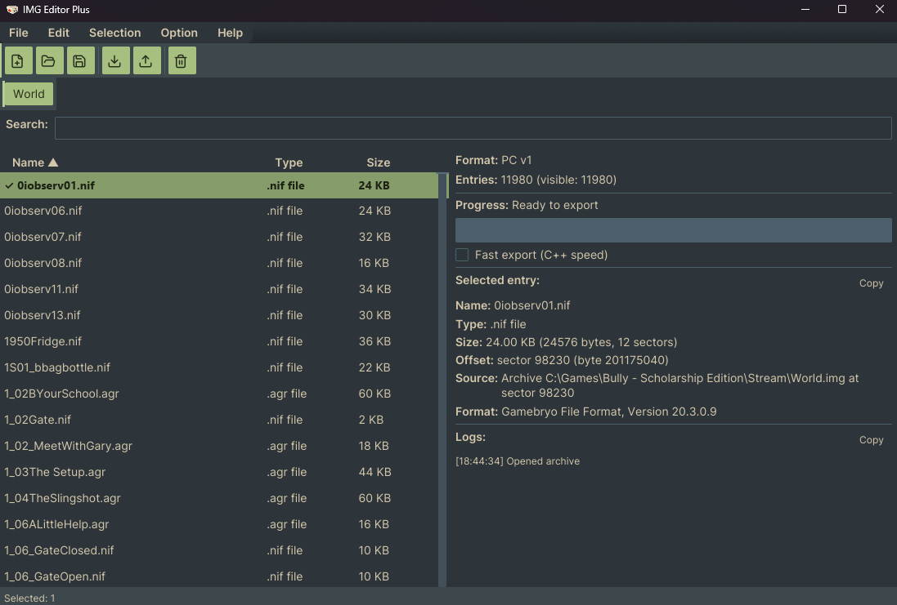

# 🎮 IMG Editor Plus v3.16.0

A **pure Rust** desktop editor for GTA IMG archives — built for **speed**, **safety**, and a modern workflow.

> Forked and evolved from [Grinch_'s IMG Editor](https://github.com/user-grinch/IMGEditor).  
> Rewritten in Rust to eliminate crashes, memory bugs, and dependency hell.

---

## 🔥 Why Rust?

The original C++ IMG Editor worked well, but maintaining it meant fighting:

| Problem | Rust fixes it |
|---------|---------------|
| 💥 **Null pointers / use-after-free** * | Ownership + borrow checker at compile time |
| 🧵 **UI thread blocking on I/O** * | Tokio `async` + spawn blocking for save/export |
| 📦 **Vendored C++ libs** (FreeType, FreeImage, GLFW, GLM, GLEW) | All dependencies via `cargo` — no manual setup |
| 🐛 **Memory corruption in format parsers** | `Result`-based error propagation, no unsafe |
| 🐌 **Slow exports on large archives** * | Zero-copy parallel export streams entries straight from the memory-mapped archive; two-pass sequential save/rebuild; UI stays responsive |
| 🎨 **ImGui theming limitations** | Iced 0.14 reactive UI with a full design token system |

\* *On a 12,000-entry Bully `World.img` benchmark, the default `ZeroCopy` engine beat the reference C++ parser in every interleaved round (median 22.4 s vs 23.3 s). Both are pinned by a Windows rate limit on rapid small-file creation (~500–600 files/s sustained on the test machine) — a measured, documented hard limit that no export code can bypass. Save/rebuild dodges that limiter by writing one large file and gained ~23 %. See [docs/rust-vs-cpp-merits.md](docs/rust-vs-cpp-merits.md) and [docs/export-optimization-lessons.md](docs/export-optimization-lessons.md) for the full analysis.*
\* *The Rust port is not a magical order-of-magnitude speedup. The workload is Windows I/O-bound, and the C++ parser was already close to the practical warm-cache ceiling. Rust's reimplementation wins on throughput only modestly; its larger advantages are **safety, responsiveness, cancellation, and maintainability**. See [docs/rust-vs-cpp-merits.md](docs/rust-vs-cpp-merits.md) for the honest breakdown.*
\* *See [docs/cpp-codebase-analysis.md](docs/cpp-codebase-analysis.md) for a source-level review of the original C++ codebase. The null-pointer and UI-blocking issues are real, but the analysis shows they are more nuanced than the one-line summary suggests (e.g. save/export were already threaded in C++; the main remaining UI blockers were Open and Import).*
**Result**: a portable, single-binary editor that _won't_ segfault on a 10,000-entry archive.

---

## ✨ Features

### 📁 Archive Management
- ✅ **IMG v1** — GTA III, Vice City, Bully Scholarship Edition
- ✅ **IMG v2** — GTA San Andreas
- ✅ **Create / Open / Save / Save As** with version selection
- ✅ **Import files** — single, multiple, or replace mode
- ✅ **Export all or selected entries** — async with progress bar + cancel
- ✅ **Zero-copy exports** — mmap-direct writes with in-memory path resolution and a buffered parallel fallback when a memory map is unavailable
- ✅ **Two-pass sequential save** — rebuilds stream entry data straight from the source memory map; ~23 % faster rebuilds on large archives
- ✅ **Memory-mapped reads** — instant open on large archives
- ✅ **Multiple archive tabs** with dirty-file indicator
- ✅ **Drag-and-drop** — open `.img` archives or import files from Explorer

### 🎨 Embedded 3D Model Viewer (v3.4+)
- ✅ **In-app wgpu renderer** — same wgpu device Iced uses, no second window or thread battle
- ✅ **Tab split in the right pane** — `Model 3D` (new) | `Texture` (TXD/NFT preview)
- ✅ **Orbit / pan / zoom camera** — LMB drag to orbit, MMB drag to pan, wheel to zoom
- ✅ **Lit + wireframe pipelines** — single WGSL shader, `W` cycles wireframe (toolbar)
- ✅ **MSAA 4x anti-aliasing** — the scene pass renders into multisampled color + depth targets and resolves for smooth model edges
- ✅ **Textured paths** — DFF/TXD diffuse mapping plus DXT1/2/3/4/5 decoding on `spawn_blocking` so the UI thread stays responsive
- ✅ **Alpha-aware 3D materials** — RGBA cutouts and transparency use a standard alpha-blended render path, with an in-viewer toggle for opaque/debug inspection
- ✅ **Bully NFT companion textures** — embedded Gamebryo pixel data and archive-backed source paths are previewed as RGBA
- ✅ **External PLY viewer fallback** — right-click `Open in external viewer` for non-NIF formats (DFF / COL) and any user preference
- ✅ **Configurable base orientation** — Y-up default, `B` cycles to Z-up / X-up. Persists in `settings.ini`.

**v3.5 viewer polish:**
- ✅ **Blender-style orbit** — mouse-right moves the view left (matching Blender's turntable feel)
- ✅ **Rotating view-axis gizmo** — the small XYZ widget in the corner tracks the camera as it orbits
- ✅ **AA grid floor** — derivative-based, screen-space-constant ~1px lines with sub-pixel fade (Blender/Golus style)
- ✅ **Full turntable orbit** — camera can pitch all the way around; the floor stays as a guide by dimming itself to ~45% when seen from underneath instead of vanishing
- ✅ **308 tests passing** — covers parser, two-pass save, zero-copy export, inspector, scene3d mesh/camera/decode/pipeline, alpha rendering, session state, sorting, drag-and-drop, UV mapping, cache invalidation, and headless wgpu against real Bully and RenderWare fixtures

**v3.16.0 release highlights:**
- ✅ **GTA RenderWare preview** — in-app PC DFF model parsing with frame/atomic transforms and TXD diffuse texture resolution for GTA III/VC/SA-style assets
- ✅ **PC TXD raster coverage** — D3D8/D3D9 dictionaries, palette formats, DXT2/4, and bounded dimension-safe decoding
- ✅ **Zero-copy export and two-pass save** — large archives stream directly from the memory map with a safe buffered fallback when needed
- ✅ **Synchronized texture previews** — image, grid, and NIF UV overlays share the same full-panel zoom and pan viewport
- ✅ **Portable mesh wire overlay** — inspect visible triangle edges in the in-app 3D viewer without changing the textured render
- ✅ **Selection-aware previews** — switching entries updates the active 3D or texture view without requiring a manual scene reset
- ✅ **Optional interaction feedback** — configurable row wobble, pulse, and ripple effects with theme-aware text contrast
- ✅ **Responsive GUI polish** — adaptive context menus, repaired sorting, clearer tooltips, and a centered welcome presentation
- ✅ **Smooth exponential camera zoom** — mouse-wheel lines and high-resolution pixel scrolling use one consistent, reversible zoom curve
- ✅ **Refined Blender-style panning** — MMB camera movement is slightly more responsive while preserving the existing screen-space direction

---

## 🐇 Export & Save Performance

By default, exports use the **`ZeroCopy` engine**: entry data is written
straight from the memory-mapped archive (no intermediate buffers, no per-entry
allocations), output paths are pre-resolved in memory instead of per-file disk
checks, and Rayon work-steals per entry. The GUI stays responsive and you can
cancel mid-export. When a memory map is unavailable, the implementation
automatically falls back to buffered parallel workers. There is no separate
speed toggle to configure or persist.

**Measured on Bully `World.img` (1.93 GB, 11,980 entries):** ZeroCopy beat the
reference C++ benchmark in every interleaved round — median **22.4 s vs
23.3 s**. The margin is deliberately honest: Windows globally rate-limits rapid
small-file creation (~500–600 files/s sustained on the test machine), which
sets a ~20–22 s floor for *any* exporter on this workload. Rebuilds dodge that
limiter entirely — the two-pass sequential save is **~23 % faster** (8.6 s →
6.6 s median) and writes entry data with zero copies.

See [docs/rust-vs-cpp-merits.md](docs/rust-vs-cpp-merits.md) for the full
head-to-head numbers and [docs/export-optimization-lessons.md](docs/export-optimization-lessons.md)
for the engineering story.
### 🔍 Entry Table
- ✅ **Virtualised scrolling** — smooth even at 10,000+ entries
- ✅ **Real-time search filter** with debounced input (150ms)
- ✅ **Sort by Name / Type / Size** with arrow indicators
- ✅ **Multi-selection** — Ctrl+click toggle, Shift+click range
- ✅ **Inline rename** — double-click to edit
- ✅ **Context menu** — Render, View textures, Export, Rename, Delete

### 🖼️ 3D Model Viewer
- ✅ **NIF** (Gamebryo 20.3.0.9) — Bully Scholarship Edition models, textured OBJ+MTL or PLY export → system viewer
- ✅ **DFF** (RenderWare Clump) — GTA III/VC/SA-style PC models in the embedded viewer with frame/atomic transforms, material splits, and TXD diffuse textures; PLY fallback remains available
- ✅ **COL** (Collision v1/v2/v3) — collision meshes with sphere/box debug shapes, PLY export → system viewer

### 🎨 Texture Viewer
- ✅ **TXD** (RenderWare Texture Dictionary) — PC D3D8/D3D9 plus legacy platform-independent parser + bounded raster decoder (DXT1/2/3/4/5, 1555, 565, 4444, 8888, PAL4, PAL8, + more)
- ✅ **NFT** (Bully/Gamebryo texture catalog) — embedded DXT1/DXT3/DXT5 payloads and archive-backed TGA/DDS/PNG sources
- ✅ **Inline preview** — cached RGBA preview in the info panel, shared by TXD, NFT, and rendered NIF/DFF textures
- ✅ **Multi-texture selector** — navigate textures within a TXD or NFT
- ✅ **UV overlay** — toggle matching NIF/DFF triangle UVs over the fit-to-preview texture
- ✅ **Texture-only guidance** — standalone TXD/NFT previews clearly explain when UV geometry is unavailable and how to enable it
- ✅ **Export to TGA** — dump all textures to `.tga` files

### 🧪 Entry Inspector
- ✅ **Per-entry metadata** — name, type, size, offset, source
- ✅ **RenderWare detection** — chunk type + version for `.txd`/`.dff`/`.ifp`
- ✅ **Collision version detection** — COLL / COL2 / COL3 / COL4
- ✅ **Text file line counts** — for `.ipl`/`.ide`/`.dat`/`.scm`
- ✅ **Hex preview** — first 32 bytes for unknown formats
- ✅ **Copy entry details** to clipboard

### 🏗️ Design & UX
- ✅ **6 theme modes** — Dark, Light, Catppuccin Mocha, Tokyo Night, Gruvbox, **Everforest**
- ✅ **Design token system** — Tailwind-inspired color/spacing/radius/elevation scales, vendored in-tree
- ✅ **Smooth animation engine** — 26 easing curves, animated progress bar, animated status-bar pulse
- ✅ **Inter + Bricolage + Lucide icon fonts** — clean, modern typography
- ✅ **Resizable master/detail panes** — drag the splitter
- ✅ **Editable keyboard shortcuts** — see table below
- ✅ **DPI-aware** window sizing

---

## 🎨 Themes

Pick your vibe from the **Themes** menu. Every theme is wired into a shared design-token system so buttons, tables, modals, and accents stay consistent.

<details>
<summary>Click to preview all themes</summary>

### Default Light
A clean, neutral workspace that keeps the focus on your archive contents.


*Bright surfaces, crisp text, and a friendly blue accent — perfect for daytime editing.*

### Default Dark
The built-in dark mode for late-night archive work.


*Deep greys with subtle contrast and a calm purple primary — easy on the eyes in low light.*

### Catppuccin Mocha
A cozy, pastel-rich dark theme with soft purples and blues.


*Warm, muted colors that feel like your favorite coffee shop playlist.*

### Tokyo Night
A sleek, neon-tinged dark theme inspired by the city after dark.


*Cool purples and electric cyans for a modern, developer-centric look.*

### Gruvbox Dark
A retro, low-contrast dark theme with earthy tones.


*Vintage amber and olive greens that hark back to classic terminal palettes.*

### Everforest 🌲
A comfortable green-based dark theme designed to be warm and soft.


*Muted sage greens and creamy text — the newest addition for users who want a natural, forest-inspired workspace.*

</details>

### ⚙️ Configuration
- ✅ **`settings.ini`** — persists theme, window geometry, last-used folders, update preferences
- ✅ **Auto-update checker** — GitHub release tags, semver comparison
- ✅ **Toggle update checks** — from the welcome dialog or Help menu
- ✅ **"Don't show again"** — welcome screen toggle

---

## 🚀 Quick start

Requires **Rust 1.96+** and a Windows desktop.

```powershell
cargo build --release
```

Binary: `target\release\imgeditor.exe`

Or package a release:

```powershell
.\package-release.ps1
```

The `dist\` folder then contains the portable `.exe`, `README.md`, and `LICENSE`.

---

## 🗺️ Roadmap

### Cross-platform ports
The codebase is architected so the core parsers and archive logic are platform-agnostic. A future release will add:

- **macOS** — gate the Windows console-hide and `.ico` resource logic, use `dirs` for config paths, and package as an `.app` bundle.
- **Linux** — same core work plus `.desktop` entry and AppImage/flatpak packaging.

The main UI layer uses Iced, which is cross-platform by design, so the desktop porting effort is mostly packaging and platform-specific window integration.

### Platform-specific note on GTA support
Version 3.x is developed and tested primarily against **Bully Scholarship Edition** archives, with the embedded viewer now covering common PC RenderWare DFF/TXD assets used by GTA III, Vice City, and San Andreas. Genuine per-game fixtures are still needed for compatibility claims; console-native geometry, skinning, animation, and advanced RenderWare material effects remain future work. Broader GTA workflow polish — importing, exporting, and format edge cases — will be addressed as representative archives become available.

### Unicode and non-ASCII language support
Core archive parsing stores entry names as UTF-8, so non-ASCII characters inside archives round-trip correctly. However, full support for languages like Russian (Cyrillic) is not yet guaranteed:

- Some UI paths and logs still fall back to lossy conversion (`to_string_lossy`), which can mangle Cyrillic file paths.
- Embedded fonts cover Latin well, but Cyrillic glyph coverage depends on the active font.
- A future release will audit all path/string display code, ensure proper `OsStr` handling, and verify Cyrillic (and other scripts) render correctly end-to-end.

---

## ⌨️ Keyboard shortcuts

| Shortcut | Action |
|----------|--------|
| `Ctrl+N` | New archive |
| `Ctrl+O` | Open archive |
| `Ctrl+S` | Save in place |
| `Shift+S` | Save as |
| `Ctrl+I` | Import files |
| `Shift+I` | Import and replace |
| `Ctrl+E` | Export all |
| `Shift+E` | Export selected |
| `Ctrl+A` | Select all |
| `Shift+A` | Invert selection |
| `Shift+X` | Close tab |
| `Delete` | Delete selected |

---

## 📦 Dependencies

Built on the [Iced](https://iced.rs/) GUI framework with Tokio async. Notable crates:

| Crate | Purpose |
|-------|---------|
| `iced 0.14` | Reactive GUI (image, svg, advanced, lazy) |
| `iced_aw 0.14` | Menu bar, tabs, context menus |
| `tokio 1.40` | Async runtime (multi-thread, fs, sync) |
| `memmap2` | Zero-copy archive reads |
| `rayon` | Parallel entry export |
| `rfd` | Native Windows file dialogs |
| `ureq` | Update checker (HTTP) |

---

## 🙏 Credits

- **Grinch_** — the original [IMG Editor](https://github.com/user-grinch/IMGEditor) that made this possible
- **MexUK & the IMGF team** — the [IMG Factory](https://github.com/MexUK/IMGF) whose feature set inspired many of the Plus additions (TXD tools, orphan detection — adapted and reimplemented in Rust)
- **CloudyTabzy & Agents** — Rust port, parsers, design system, 3D viewers
- **Iced team** — the reactive GUI framework this is built on

---

## 📄 License

This project is **MIT licensed** © 2025 CloudyTabzy. See [LICENSE](LICENSE) for the full text.

**Dependency licenses:** every crate this project depends on is MIT-licensed (Iced, Iced AW, Tokio, Rayon, etc.). The bundled fonts — Inter, Bricolage Grotesque, and Lucide icons — are licensed under the SIL Open Font License 1.1.
